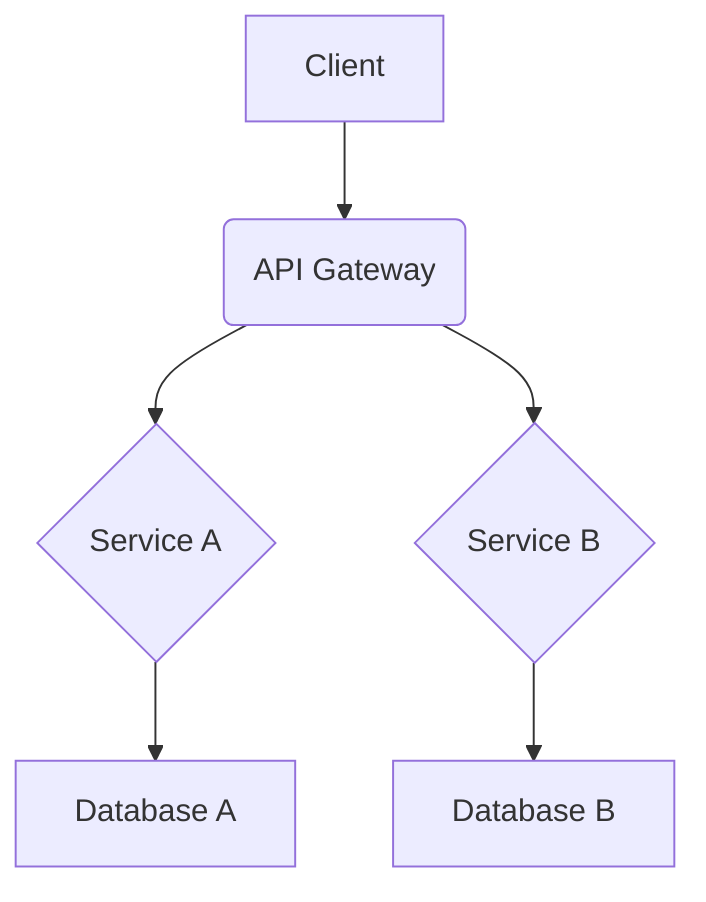

# システムアーキテクチャ

## 🏗️ プロジェクト: TEST01

## 📋 技術スタック
- **言語**: Python
- **フレームワーク**: FastAPI
- **データベース**: [設定予定]
- **インフラ**: [設定予定]

## 🏛️ アーキテクチャ概要
*PoC完了後に詳細を記載*

### システム構成図

### コンポーネント構成
*主要コンポーネントとその責務*

## 🔗 API設計
*API仕様をここに記載*

## 🗄️ データベース設計
*テーブル設計・ER図をここに記載*

## 🔒 セキュリティアーキテクチャ
*セキュリティ要件: 中（一般的なWebアプリ）*

## 📈 拡張性・可用性設計
*非機能要件の実現方法*

## 📝 更新履歴
- 2025-05-25: 初期ドキュメント作成
