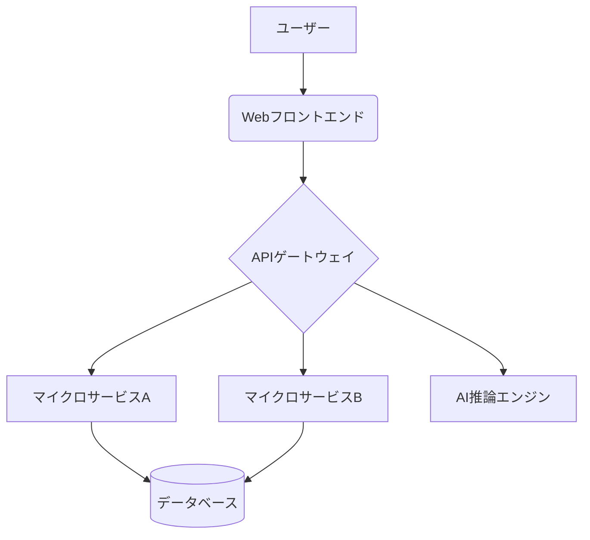

# アーキテクチャ設計書 ([プロジェクト名])

## 1. はじめに

-   **目的**: このドキュメントは、[プロジェクト名] のシステムアーキテクチャについて記述します。
-   **スコープ**: [スコープを記述。例: 主要コンポーネント、外部連携、データフローなど]
-   **対象読者**: 開発者、プロジェクトマネージャー、インフラ担当者
-   **最終更新日**: [YYYY-MM-DD]

## 2. アーキテクチャ目標と制約条件

-   **ビジネス目標**:
    -   [関連するビジネス目標を記述]
-   **技術目標**:
    -   [例: スケーラビリティ、可用性、保守性、セキュリティなど]
-   **制約条件**:
    -   [例: 利用技術スタックの制限、予算、期間、既存システムとの連携など]

## 3. システム概要

[システムの全体像を説明する簡潔な説明と、主要な機能ブロックを示した概要図を記述します。]

*上記はサンプルです。プロジェクトに合わせて修正してください。*

## 4. コンポーネント設計

[主要なコンポーネントごとに、その役割、責務、インターフェース、使用技術などを詳細に記述します。]

### 4.1. [コンポーネント名1]

-   **説明**:
-   **使用技術**:
-   **インターフェース**:

### 4.2. [コンポーネント名2]

-   **説明**:
-   **使用技術**:
-   **インターフェース**:

## 5. データ設計

-   **データモデル**: [主要なエンティティとリレーションシップを示すER図など]
-   **データベース選択理由**:
-   **データフロー**: [システム内でのデータの流れを図や説明で示す]

## 6. インフラストラクチャとデプロイメント

-   **ホスティング環境**: [例: AWS, Azure, GCP, オンプレミス]
-   **主要サービス**: [例: EC2, S3, Lambda, Kubernetes, Docker]
-   **デプロイメント戦略**: [例: CI/CDパイプライン、Blue/Greenデプロイメント]

## 7. セキュリティ設計

-   **認証・認可**:
-   **データ保護**:
-   **ネットワークセキュリティ**:

## 8. 非機能要件への対応

-   **パフォーマンス**:
-   **スケーラビリティ**:
-   **可用性・信頼性**:
-   **保守性**:

## 9. 技術選定理由

[主要な技術（言語、フレームワーク、DB、AIモデルなど）を選定した理由を記述します。]

## 10. 今後の課題・検討事項

[現時点での課題や、将来的に検討が必要な事項を記述します。]

## 11. 付録

-   **用語集**:
-   **参考文献**:
