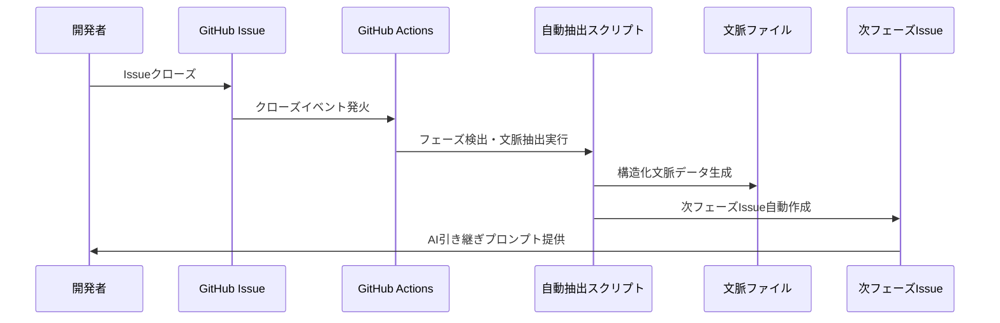

# GitHub連携自動文脈継承システム

## 🎯 概要

このシステムは、GitHubのIssue/PRクローズ時に自動的にAI文脈情報を抽出・継承し、次フェーズの開始を支援します。

## 🔄 自動化フロー

### 1. フェーズ完了時の自動処理



### 2. 設定手順

#### 2.1 GitHub Secretsの設定

1. リポジトリの `Settings` → `Secrets and variables` → `Actions`
2. 以下のSecretを追加：
   - `GITHUB_TOKEN`: GitHub APIアクセス用（通常は自動設定済み）

#### 2.2 フェーズラベルの設定

自動文脈継承を有効にするため、以下のラベルをIssueに付与：

- `phase:requirements` - 要件定義フェーズ
- `phase:poc` - PoCフェーズ
- `phase:implementation` - 実装フェーズ
- `phase:review` - レビューフェーズ
- `phase:testing` - テスト・デプロイフェーズ

### 3. 使用方法

#### 3.1 要件定義フェーズの完了

1. 要件定義Issueテンプレートを使用してIssueを作成
2. 必須セクションを記入：
   - **重要決定事項**: 技術選択、ビジネス決定
   - **制約条件・要件**: セキュリティ、パフォーマンス要件
   - **学習・気づき**: ユーザー行動パターン、技術的発見
   - **次フェーズ重点項目**: PoCで検証すべき項目
3. `phase:requirements` ラベルを付与
4. Issueをクローズ

**自動実行される処理:**
- 文脈情報の抽出・構造化
- `docs/ai-context/ai-context-requirements.yml` の生成
- PoCフェーズ開始Issueの自動作成
- AI引き継ぎプロンプトの生成

#### 3.2 PoCフェーズの完了

1. PoC結果Issueテンプレートを使用
2. 必須セクションを記入：
   - **技術検証結果**: 実現可能性、パフォーマンス確認
   - **推奨アーキテクチャ**: 実装で使用する設計方針
   - **発見事項**: 技術的制約、最適化ポイント
3. `phase:poc` ラベルを付与
4. Issueをクローズ

**自動実行される処理:**
- 技術検証結果の構造化
- `docs/ai-context/ai-context-poc.yml` の生成
- 実装フェーズ開始Issueの自動作成

#### 3.3 その他フェーズでも同様

実装 → レビュー → テスト・デプロイの各フェーズでも、同じパターンで自動文脈継承が実行されます。

## 📋 生成される文脈ファイル形式

```yaml
# docs/ai-context/ai-context-requirements.yml
phase: "requirements"
completion_date: "2025-05-25"
issue_reference: "#123"
repository: "owner/repo-name"
ai_tools_used:
  - "github-copilot"
  - "claude"
key_decisions:
  - decision: "技術スタックにNext.js + TypeScript採用"
    reasoning: "チーム経験、型安全性、パフォーマンス"
    impact: "実装フェーズ全体"
critical_constraints:
  - type: "security"
    description: "金融データ取り扱いのため高セキュリティ要件"
learned_patterns:
  - pattern: "ユーザーは複数デバイス対応を重視"
    evidence: "インタビュー結果、競合分析"
next_phase_focus:
  - "認証機能のPoC優先"
  - "パフォーマンス計測の仕組み"
technical_artifacts:
  - type: "code_block"
    content: "```javascript\n// サンプルコード\n```"
quality_metrics:
  coverage: "85%"
  test_count: "12"
```

## 🤖 AI引き継ぎプロンプトの活用

自動生成されるAI引き継ぎプロンプトは、新しいフェーズでAIツールを使用する際にコピー＆ペーストで利用できます：

```text
あなたはプロジェクト名のPoCフェーズを担当するAIです。
前フェーズ（要件定義）で以下が決定されました：

## 重要決定事項
- 技術スタックにNext.js + TypeScript採用
  理由: チーム経験、型安全性、パフォーマンス
  影響: 実装フェーズ全体

## 制約条件
- security: 金融データ取り扱いのため高セキュリティ要件

## 学習パターン
- ユーザーは複数デバイス対応を重視
  根拠: インタビュー結果、競合分析

## あなたの今フェーズの責務
- 技術実現可能性の検証
- アーキテクチャ選択肢の提示
- リスクの早期発見

これらの文脈を踏まえて、PoCフェーズを開始してください。
```

## 🔧 手動実行方法

自動化が動作しない場合や、任意のタイミングで文脈継承を実行したい場合：

```bash
# 文脈抽出の手動実行
node scripts/auto-context-extractor.js \
  --phase="requirements" \
  --issue-number="123" \
  --issue-title="要件定義完了" \
  --issue-body="$(cat issue-body.txt)" \
  --repository="owner/repo"

# 次フェーズ文脈生成の手動実行
node scripts/generate-next-phase-context.js \
  --current-phase="requirements" \
  --repository="owner/repo"
```

## 📊 効果測定

自動文脈継承システムの効果は、以下のメトリクスで測定できます：

- **文脈継承完了率**: フェーズ完了時の自動処理成功率
- **次フェーズ開始時間**: 文脈引き継ぎから作業開始までの時間
- **決定事項一貫性**: フェーズ間での決定事項の整合性
- **手戻り削減率**: 文脈ロスによる手戻りの削減効果

## 🚀 今後の拡張可能性

1. **AIツール連携**: Claude/ChatGPT APIとの直接連携
2. **プルリクエスト連携**: コードレビュー結果の自動文脈化
3. **Slack/Teams通知**: フェーズ完了・開始の自動通知
4. **ダッシュボード**: 文脈継承状況の可視化
5. **品質スコア**: 文脈継承品質の自動評価

---

このシステムにより、従来手動で行っていたフェーズ間の文脈継承が自動化され、AI開発ワークフローの効率性と一貫性が大幅に向上します。
